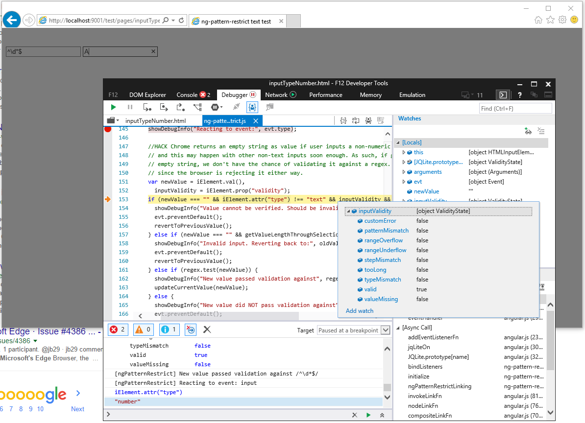

# Compatibility notes

A.K.A. known issues that I cannot really fix. Yeah, browsers do not make it easy for me. Here are my findings, datestamped, with the problems you may find in different browsers and known workarounds. If you find workarounds or fixes to these problems, please, feel free to let me know by a [submitting an issue][submit an issue] or by [submitting a pull request][submit PR].

## IE

### IE 11 won't react to bad input

**Tested:** 2015-09-06, IE 11.0.10240.16431, Win 10.

**Symptom:** On an input type=number, the user enters a valid number. Then the user enters an invalid number which is also an invalid pattern on an input type=number textbox. ng-pattern-restrict reverts back to empty string instead of the previous valid number.

**Cause:** When this happens, IE will report a valid empty string without signs of the non-numeric input. The ValidityState object of the input will not reflect any type of invalid input, so ng-pattern-restrict cannot tell this case apart from when a user actually enters nothing, or erases everything. Also, IE will delete the contents of the input when the user focuses out of it.

[submit an issue]: https://github.com/AlphaGit/ng-pattern-restrict/issues/new
[submit PR]: https://github.com/AlphaGit/ng-pattern-restrict/pulls

## Android

### Cannot test on Protractor with Android Browser

**Tested:** 2015-09-06, Android 5.1, Android Emulator ([details](https://saucelabs.com/beta/tests/2cf309f1429445c188cb105c25037695))

**Symptom:** While testing with Android Browser, all the tests will fail with the following error message:

> {"message":"[$injector:modulerr] Failed to instantiate module p due to:\nError: [$injector:nomod] Module 'p' is not available! You either misspelled the module name or forgot to load it. If registering a module ensure that you specify the dependencies as the second argument. (...)"}

**Cause:** Not really known, seems to be a problem with the WebDriver for this version. The problem seems to arise from the following call from Protractor:

    POST execute
    {"args":[["protractorBaseModule_"]],"script":"angular.resumeBootstrap(arguments[0]);"}

The `arguments[0]` parameter should resolve to `protractorBaseModule_`, but I believe it is resolving to the `p`, being the first character of that string. This does not seem to happen on other platforms or versions.

**More information:**

- [Using Protractor + Appium + SauceLabs](http://stackoverflow.com/a/30857288/147507) (StackOverflow). Using the 4.4 version does not fix the problem, as indicated by the answer.

## Safari

### Cannot simulate text-replacement

**Tested:** 2015-09-07, OS X 10.11, Safari 8.1 ([details](https://saucelabs.com/beta/tests/8db6e1e8963f4530bb9bee010312353a))

**Symptom:** ng-pattern-restrict will not go back to the previous valid value in Protractor tests.

**Cause:** Safari will update the value of the numeric inputs both on `POST /clear` and `POST /value`, and as such, the tests have no way of simulating the user replacing one text for another, such as selecting the whole text and typing over it.

The rest of the browsers handle it well with the combination of `clear` and `sendKeys`, but the Safari drivers will update the value twice, and fire the onchange events.

Furthermore, simulating the selection of the text through CMD+A is not possible, since OS X does not support emulating native keystrokes. See [this ticket in GitHub](https://github.com/angular/protractor/issues/690).